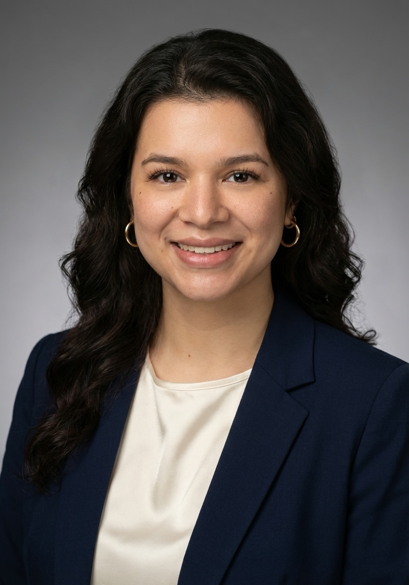

# Isabelle Araojo

## About Me
I am a graduate student pursuing an M.S. in Data Science and Analytics 
at Old Dominion University, with a concentration in Business Intelligence 
Analytics. I hold a B.A. in Environmental Science from the University of 
Virginia and have research experience in data analysis, oceanography, and 
digital engagement. I am passionate about applying data-driven approaches 
to challenges in health, environmental sustainability, and public policy.

📧 iaraojo15@gmail.com 
🔗 [LinkedIn](https://www.linkedin.com/in/isabellearaojo/)

## Resume
[📄 Download My Resume](resume.pdf)
